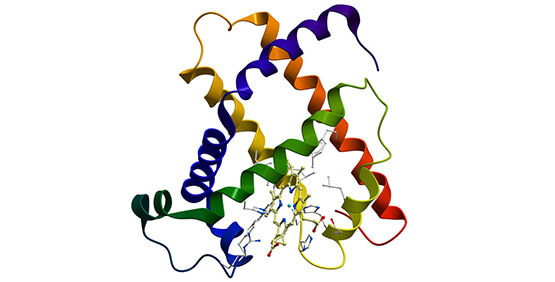

Image from: https://www.google.com/

## Overview
The main function of ACTIN DEPOLYMERIZING FACTOR (ADF) is to regulate filamentous actin (F-actin) organization and dynamics, and to contribute to the growth and development of the organism, as well as various abiotic and biotic stress responses. What is more, recent studies have shown that some ADFs can enter into the nucleus to regulate gene expression in Arabidopsis. Understanding the evolution of plant cellular complexity has been described as one of the most important challenges of modern biology, and it is one of the best ways to explore the function of individual genes in order to reduce time-consuming bench work. However, while the most common way to build an evolution tree is by using protein information of the coding area, recently researchers have pointed out that non-coding areas also play a very important role in protein evolution.

Thus, I plan to explore the function of individual ADF through understanding the evolutionary history of ADF by using a new computational method to achieve the above goal - building new evolution trees by combining coding and non-coding areas. To achieve this goal, the project will utilize the power of public gene information databases, genetic algorithms, and protein algorithms. After these 3 pieces of information are provided by my new computation methods, a new evolution tree will be built. Keywords: Evolution, ADF, Function Prediction.

## Program Description
For this project, all the components of evolution already exist. What I need to do in the next few months is Step1: Collect gene structure information and protein information about ADF genes from the existing public databases; Step2: Write my algorithm python code and import all the above information into my algorithm; Step3: Build a new evolution trees by combining coding and non-coding areas. Step4: Improve my algorithm with various additions as needed.

## Project Goals
**Short Term**: Collect gene structure and protein information of ADF. Starting to write my python code.

**Mid Term**: Import the above information into my python code and make it work. Adjusting my algorithmic code to find the most fitness performance.

**Long Term**: Generate the evolution tree automatically when the user provides the genetic and protein information.

## Timeline
1/29/2021 - Create git repository

2/12/2021 - Proposal due

2/26/2021 - Gene structure and protein information Collection

3/05/2021 - Spring break

3/07/2021 - Writing my algorithm in python

3/25/2021 - Review some latest research papers and figure out what additions are needed

4/9/2021 - Code Review and all the results and presentation finalized

4/16/2021 - Presentation Video due

4/23/2021 - Final Report and Code due

## Anticipating Challenges
What I need to learn includes how to finish a project on GitHub by myself alone; how to use python code to present my research to others; how to write each step of code then merge them into my whole project. The challenge will be that there is no protein information available from the existing public databases about the non-coding area. If this happens, I may need to find their orthologous genes from other species, and then use this information. I think my whole project could be written with python.
